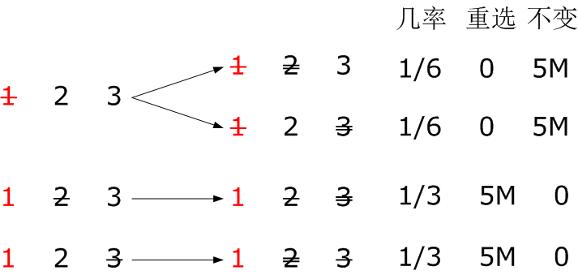

# 学科技术前沿讲座思考题

*北京学院 王郁含 16182672*

## 3.1
> 在一个游戏中，主办方在三个门中任选一个，在门后放了一个奖品，另外两个门之后是空的。选手要在三个门中选择一个抽奖。 当选手选择了一个门，未曾打开门之前，主办方打开了另外两个门中没有奖品的那个门，并向选手说， 他可以改变他的选择，即转为选择剩下一个没有打开的门。 请问，如果选手此时改变选择， 他会提高或降低获奖的可能性么？提高多少？请给出你的分析。

答：记三个门的标号为1、2、3，不妨以门1后面有奖品为例。单删除线是选手的选择，双删除线是主办方选择打开的门。
根据穷举法，赢钱的几率：重新选择 2/3，维持不变 1/3。

## 3.2

> 如何看待 “中文房间” 问题，中文房间有智能么？它有什么样水平的智能？如何才能让它具有人类水平的智能？

答：我认为中文房间中不存在智能。

​       首先，我认为**单凭语法本身并不足以构建语义**。虽然在房间中的人通过查阅能够回答问题，但是，他所有的回答都是基于已经设定好的知识给出的结果。宛若一个编译器一样解析传送进来的东西。但是因为存在二义性的问题，所以他不可能时时刻刻都能够做出正确的回答。例如中文中的“冬天想穿多少穿多少，夏天想穿多少穿多少”，中文房间中的人就无法做出正确的判断了。

​       其次，如果从是否有智能从中产生的角度来讲，**中文房间也没有智能从中产生**。因为里面的人只能从书本中获取知识传达出去。例如，我在早上问他“早上好”，他会回答我“早上好”，这没有任何问题。但是如果我在晚上问他同样的问题，因为在他的世界里面没有时间的概念，所以他依然只会回答我“早上好”，而以智能的角度来看，显然应该回答类似于“现在已经是晚上了朋友”的回答。

​       最后，我认为**中文房间的行为不存在创新性**，这也是他没有智能的一个表现。因为在他的知识体系里面，存在的已经存在，不存在的也永远不会存在。像“蓝瘦香菇”这样的网络流行语，由一个人说出后，千万中国人会在瞬间理解为口音版的“难受想哭”，而在中文房间里面的人只会在自己的资料库里面寻找“一种蓝色的，瘦的香菇”，永远也不会理解这个词的真正含义，也就无法做出正确的回答。

​       至于怎样才能让其具有人类水平的智能：第一个方法是人类在发现自身的反应是如何完成之后对人工智能**进行复现**，这样经过完美复现之后就可以使其拥有人类水平的智能。但是由于人类尚且没有对自己的大脑进行充分的研究，所以这应该是很遥远的事情。第二种方法就是融合多个元件**进行更复杂的组合**。例如在很久以前其实光靠电路人们也无法想象能够有计算机这样的东西出现的，但是当电路组合出时序电路，发展出寄存器，CPU，等等部件并将其进行巧妙的组合，就出现的如今的计算机。那么如果将更多更复杂的部件组合起来——当然这里指的不是简单的堆砌元件——是不是就会出现更具迷惑性的人工智能呢？那时候就会出现更加优于中文房间的系统，例如，会“感情用事”的机器，也会同样出现那个系统存不存在智能的问题，那时候人们的评判标准也会有所改变，那就是未来科技的事了。

## 3.3

> 既然这门课讲了很多计算机前沿，那么学生就可以预计一下这些前沿知识如何能给普通用户或某个行业带来好处。 学生根据讲课的内容和参考文献，用 NABCD 的模板，描述你心目中一个使用了 “人工智能+其他前沿技术” 的创新项目。 这个项目应该是由 7 - 10 名有相关技能的大学生在 4 个月能完成。

#### 应用人工智能与物联网的结合进行流域污染源监测

- N(NEED)

  在污染越发严重的今天，河流污染问题也是越来越不可忽视的重大污染问题。然而尽管对于工厂的处罚力度一加再加，却还是无法在河流下游看到清撤的水面。到底是工厂在阳奉阴违，还是其实原本我们忽视了的问题才是罪魁祸首？需要依托新时代的新技术进行监测。

- A (Approach)

  通过人工智能与物联网的结合，在整条河流的多处放置具有矿物质检测，离子检测，浊度检测等多种传感器，加上自身携带的位置信息，将数据上传至云端，云端通过人工智能算法拟合出该条河流的污染变化情况。检测出污染激增的位置，对该位置进行突击检查，达到杜绝“面子工程”的效果。

- B(Benefit)

  无需政府派人进行实时巡逻，杜绝工厂阳奉阴违的现象。避免了官商勾结。防止工厂在特定区域、特定时间、特殊处理。大大提高了效率及准确性。

- C (Competitors)

  虽然目前国内的物联网+人工智能飞速发展，但更多的还是服务于人民，例如语音助手等。很少有厂商会想到服务于政府。然而对于政府来说这是亟待解决的环境问题。

- D (Delivery）  

  在工厂每年进行质检时要求工厂在指定位置安装监测设备，这样可以精准定位污染源；同时在整个流域的不同位置安装设备，这样可以避免工厂为了逃过检查阳奉阴违。使定位有所偏差。

